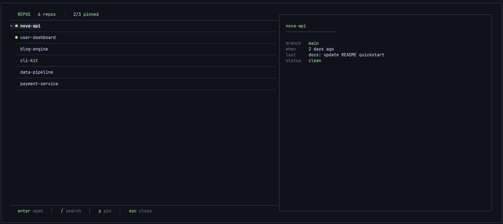
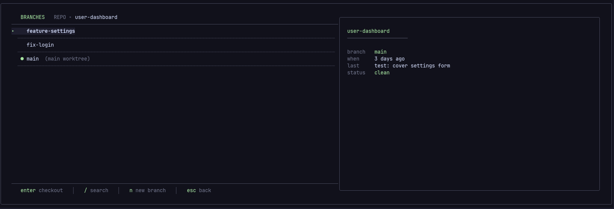
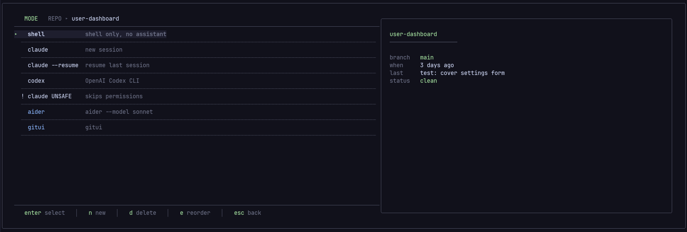
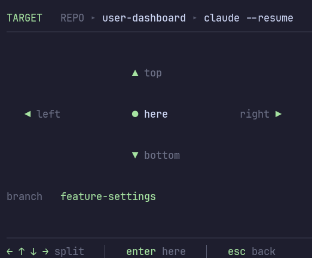
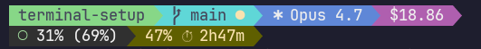

<p align="center">
  
</p>

<h1 align="center">terminal-setup</h1>

<p align="center">
  <em>A fast repo + worktree + Claude Code launcher for WezTerm on Windows.</em><br>
  <sub>Three keystrokes from a cold terminal to an isolated Claude session per branch.</sub>
</p>

<p align="center">
  <a href="LICENSE"></a>
  
  
  
  
</p>

---

## Why

Running Claude Code in parallel on Windows — one isolated workspace per branch — without WSL2, without tmux, without a daemon, without yaml.

**You get:**

- A keyboard-only launcher that picks a repo, a branch, a mode, and a pane target, and spawns `claude` in an isolated `git worktree` in ~2 seconds.
- A two-line powerline statusline for Claude Code that shows project, branch, model, cost, context use, and the 5-hour rate-limit countdown — inside the Claude UI.

No background process. No state outside `~/.local/state/wezterm/`. Uninstall leaves nothing behind.

## Tour

### REPOS — repo picker with live git preview


Repos under `~/Documents/github/`, pinned favorites (★) on top, live `git` preview as you navigate. Press `/` to fuzzy search, `p` to pin/unpin.

### BRANCHES — worktree-backed branch picker



Mandatory branch picker backed by `git worktree`. Three categories: local with `●` for current checkout, local without, and remote with `↓`. Press `n` to create a new branch inline.

### MODE — built-ins + unlimited custom modes



Built-ins: `shell`, `claude`, `claude --resume`, `codex`, `claude UNSAFE` (with confirmation). Add your own with `n`, delete with `d`, reorder with `e`.

### TARGET — compass for pane direction



Arrow keys pick the split direction; `Enter` opens in the current pane.

### Statusline — inside Claude Code



Two lines at the bottom of every Claude session: project · branch · model · cost · context · 5-hour rate-limit countdown.

## Quick start

Prerequisites (Windows 10/11):

```bash
winget install wez.wezterm junegunn.fzf jqlang.jq
```

- **fzf** ≥ 0.70 (uses `--with-shell`, `--gap`, `--header-border`, `--footer`)
- **WezTerm** recent enough to support `wezterm cli split-pane --cwd`
- **git** via Git for Windows (ships with Git Bash)
- **jq** — statusline only
- **JetBrains Mono** with Nerd Font fallback — for glyphs like `▸`, `●`, `↓`

Install:

```bash
git clone https://github.com/Joorgem/terminal-setup.git ~/Documents/github/terminal-setup
cd ~/Documents/github/terminal-setup
./install.sh
```

The installer:

- Copies `wezterm/*` into `~/.config/wezterm/`
- Copies `claude/statusline.sh` into `~/.claude/`
- Creates timestamped backups (`.bak-YYYYMMDD-HHMMSS`) of anything it overwrites

Append the `statusLine` block from `claude/settings.snippet.json` into your `~/.claude/settings.json`.

Open a new WezTerm window and run:

```bash
repos
```

### Selective install

```bash
./install.sh wezterm   # launcher only
./install.sh claude    # statusline only
./install.sh deps      # check dependencies only
```

## Usage

```
repos   →   Enter   →   BRANCHES   →   Enter   →   MODE   →   Enter   →   TARGET
```

### Keybindings

**REPOS**

| Key | Action |
|---|---|
| `Enter` | Select repo |
| `/` | Search |
| `p` | Pin / unpin |
| `Esc` | Exit |

**BRANCHES**

| Key | Action |
|---|---|
| `Enter` | Checkout (creates worktree if needed) |
| `/` | Search |
| `n` | New branch (inline prompt) |
| `Esc` | Back |

**MODE**

| Key | Action |
|---|---|
| `Enter` | Select mode |
| `n` | Add a custom mode (inline prompt: label + command) |
| `d` | Delete the custom mode under the cursor (built-ins can't be removed) |
| `e` | Reorder modes (opens a dedicated editor) |
| `Esc` | Back |

**EDIT MODES** (reached via `e` above)

| Key | Action |
|---|---|
| `↑` `↓` | Move the selected item up/down |
| `j` `k` | Alt: vim-style move down/up |
| `Enter` | Save and exit |
| `Esc` | Cancel and exit |

**TARGET** (compass)

| Key | Action |
|---|---|
| `←` `→` `↑` `↓` | Open split in that direction |
| `Enter` | Open in current pane |
| `Esc` | Back |

## Layout on disk

| Artifact | Path |
|---|---|
| WezTerm config | `~/.config/wezterm/wezterm.lua` |
| Launcher | `~/.config/wezterm/repo-launcher.sh` |
| `repos` command | `~/.config/wezterm/repos` (added to `PATH`) |
| Launcher bashrc | `~/.config/wezterm/bashrc.wezterm` |
| Claude statusline | `~/.claude/statusline.sh` |
| Pinned repos | `~/.local/state/wezterm/repo-pins.txt` (up to 3) |
| Worktree log | `~/.local/state/wezterm/worktree.log` |
| Custom modes | `~/.local/state/wezterm/custom-modes.tsv` (TAB-separated: `label<TAB>command`) |
| Mode order | `~/.local/state/wezterm/mode-order.txt` (one mode id per line) |

## Worktree model

Every branch becomes a sibling directory next to the main repo:

```
~/Documents/github/
├── my-repo/                ← primary worktree (default branch)
└── my-repo.wt/
    ├── main/
    ├── feature-x/
    └── origin--hotfix/     ← remote-tracking, auto-created
```

Slashes in branch names become `--` on disk. `git worktree prune` runs automatically when you open the branches screen.

## Updating

```bash
cd ~/Documents/github/terminal-setup
git pull
./install.sh
```

The installer overwrites with backups. Edit in the repo → push → everyone pulls.

## Customization

- **Palette** — all ANSI colors live at the top of `repo-launcher.sh` in the `FZF_THEME` array. Catppuccin Mocha with green accents.
- **Font size** — `config.font_size` in `wezterm.lua` (default `13`).
- **Repo filter** — `load_repos()` excludes `*-agent-*` and `*.wt` directories. Tweak the `grep -v` pipeline to taste.

### Custom launch modes

The MODE screen ships with five built-ins (`shell`, `claude`, `claude --resume`, `codex`, `claude UNSAFE`). You can extend it with unlimited custom modes:

- Press `n` on the MODE screen to add one — you'll be prompted for a short label and a bash command.
- Press `d` to delete the custom mode under the cursor (built-ins are protected).
- Press `e` to open the reorder editor — arrow keys or `j`/`k` move the highlighted item, `Enter` saves, `Esc` cancels.

Custom commands run via `bash -c`, so pipes, redirects, and shell flags all work. They execute in the worktree's cwd, same as the built-ins.

Examples:

```
label: aider
command: aider --model sonnet

label: gitui
command: gitui

label: tests
command: npm test -- --watch
```

## Troubleshooting

- **`fzf: command not found`** — `winget install junegunn.fzf`, then reopen the terminal.
- **Pointer `▸` renders as `)`** — missing Nerd Font glyph. Install `JetBrains Mono` with `JetBrainsMono Nerd Font` fallback.
- **`git worktree add` fails** — check `~/.local/state/wezterm/worktree.log`. Branch names with trailing `.` are rejected on Windows and we refuse them early.
- **Remote branches missing** — run `git fetch` in the repo first.

## Roadmap

Candidates under evaluation. None are commitments. Issues and PRs welcome if you want to push any forward.

- **Session matrix** (`repos --status`) — view-only scan of every worktree, showing git status and whether a Claude pane is currently active in WezTerm.
- **Pane-aware resume** — before spawning a new Claude for a worktree, detect whether a pane is already running one; focus it instead of duplicating.
- **Worktree auto-provisioning hooks** — on worktree creation, copy `.env`, symlink `node_modules`, allocate deterministic ports per branch.

## Contributing

See [CONTRIBUTING.md](./CONTRIBUTING.md). The project is small and opinionated — please read the scope note before opening a large PR.

For open-ended ideas, use [GitHub Discussions](https://github.com/Joorgem/terminal-setup/discussions).

## Security

See [SECURITY.md](./SECURITY.md) to report vulnerabilities privately.

## License

[MIT](./LICENSE) © 2026 Jorge David

## Credits

- Palette — [Catppuccin Mocha](https://github.com/catppuccin/catppuccin)
- Picker — [fzf](https://github.com/junegunn/fzf) by junegunn
- Terminal — [WezTerm](https://github.com/wezterm/wezterm) by @wez
- Assistant — [Claude Code](https://github.com/anthropics/claude-code) by Anthropic
